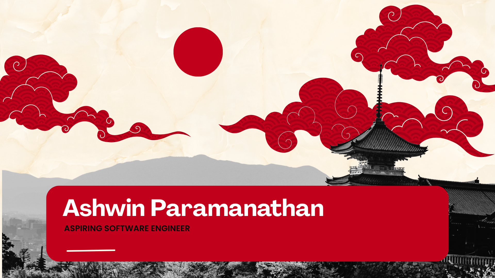

<h1 align="center">README</h1>

<h1 align="center">ASHWIN PARAMANATHAN</h1>

<h2 align="center">ASPIRING SOFTWARE ENGINEER</h2>

 

<h3 align="center">Hi 👋, I'm Ashwin</h3>
<h4 align="center">Aspiring Software Engineer passionate about Cloud Computing and Modern Software Development</h4>

I am fascinated by how cloud technology 🌐 has transformed the way we build and deploy applications; witnessing the evolution of software architecture allowed me to pursue software engineering from an early age, and my enthusiasm has only grown since. I love exploring new tech stacks 💻 and leveraging them to build cool stuff 🛠️ that solves real-world problems.

 
 

  
  
  
  
  
  

 

  
  
  
  
  

  

- 🎓 Aspiring Software Engineer from Sri Lanka

- 🚀 Passionate about **Cloud Technologies and Modern Development**

- 🌱 Currently expanding my expertise in **Software Engineering, Cloud, DevOps, and Full Stack Development**

- 👨‍💻 All of my projects are available at **[Your Portfolio Link]**

- 💬 Ask me about **Java, Python, and Cloud Computing**

- 📫 How to reach me **paramanathanashwin@gmail.com**

- 📄 Know about my experiences **[Your Resume Link]**

- ⚡ Fun fact **I see debugging as a problem-solving challenge, not an obstacle**

 

<h3 align="left">Connect with me:</h3>

 

<h3 align="left">Languages and Tools:</h3>

- **Backend**

  

- **Frontend**

  

- **Database**

  

- **Cloud & DevOps**

  

- **Tools**

  

 

<h3 align="left">Currently Learning:</h3>

  
   
  <b>• Software Engineering Principles</b> 
  <b>• Cloud Computing Fundamentals</b> 
  <b>• DevOps Tools & Practices</b> 
  <b>• Full Stack Web Development</b> 
  <b>• Scalable System Design</b>

 

<h3 align="left">Career Goal:</h3>

  <b>To become a highly skilled Software Engineer who designs innovative, scalable, and impactful technology solutions.</b>

 

<h3 align="left">GitHub Stats:</h3>

 

 

<h3 align="left">Trophies:</h3>

  

  

 <em><b>I love connecting with different people</b> so if you want to say <b>hi, I'll be happy to meet you more!</b> :)</em>

 

 Created with 🧡 by <b>Ashwin Paramanathan</b>

