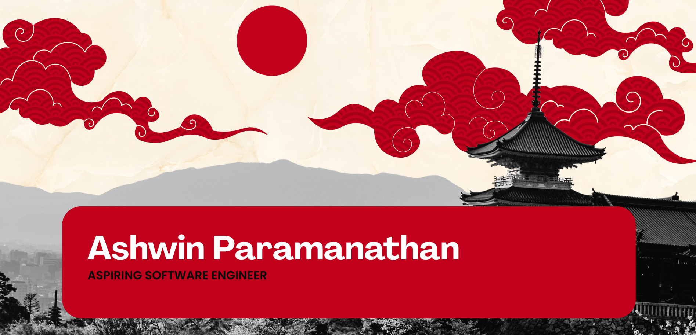

<h2 align="center">SOFTWARE ENGINEER</h2>

 

<h3 align="center">Hi 👋, I'm Ashwin</h3>
<h4 align="center">Aspiring Software Engineer passionate about Cloud Computing and Modern Software Development</h4>

I'm deeply fascinated by how cloud technology ☁️ is transforming the way modern applications are built, deployed, and scaled 🚀. Exploring the evolution of software architecture 🏗️ inspired me to pursue software engineering, and that passion continues to grow as I expand my knowledge in cloud computing ☁️, DevOps ⚙️, and full-stack development 💻. I enjoy learning new technologies 📚, experimenting with modern tech stacks 🧩, and applying them to build efficient, scalable solutions 📈 that solve real-world problems 🌍.

 
 

## 🚀 Tech Stack

  
  
  
  
  
  
  
  

---

## 👨‍💻 About Me

- 🎓 Aspiring Software Engineer from Sri Lanka
  
- 🚀 Passionate about Cloud Technologies and Modern Development
  
- 🌱 Currently expanding expertise in Software Engineering, Cloud, DevOps & Full Stack
  
- 📫 Contact: **paramanathanashwin@gmail.com**
  
- ⚡ Fun fact:  I see debugging as a problem-solving challenge  

 

---

## 🌐 Connect With Me

  
  
  
  

---

##  Currently Learning

- Java Programming    
- Software Engineering Principles  
- Cloud Computing Fundamentals  
- DevOps Tools & Practices  
- Full Stack Web Development  
- Scalable System Design  

---

## 🎯 Career Goal

To become a highly skilled Software Engineer who designs innovative, scalable, and impactful technology solutions.

---

## 📊 GitHub Stats

---

## 🏆 Achievements

---

**I love connecting with people — feel free to say hi!**

---

Created with 🧡 by <b>Ashwin Paramanathan</b>

 

